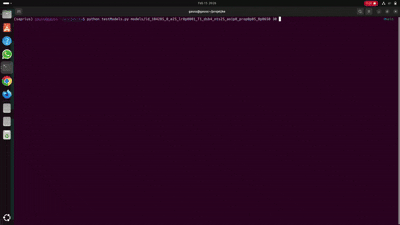

# Diffusion Schrödinger Bridge (DSB) for Generative Modeling

## Project Overview

This project implements the **Diffusion Schrödinger Bridge (DSB)** algorithm, a generative modeling technique. This work is part of a **student project on Schrödinger Bridges and their application to temporal series and image generation**. Here, the focus is on **image generation using the MNIST dataset**.

DSB addresses limitations of traditional Score-Based Generative Models (SGMs) by iteratively learning a diffusion process that optimally transports probability mass between a data distribution and a prior distribution over a finite time horizon. 

The implementation includes:
*   A U-Net architecture for the mean-predictor neural networks.
*   Feature-wise Linear Modulation (FiLM) for time conditioning.
*   Positional encoding for time steps.
*   An iterative proportional fitting (IPF) training loop for DSB.
*   A hyperparameter search framework to find optimal model configurations.

Inspired by the following paper: https://arxiv.org/abs/2106.01357v1

## Repository

The project repository is available on GitHub:
[https://github.com/Gauss-Taylor-Euler/ea-shrodinger-bridge](https://github.com/Gauss-Taylor-Euler/ea-shrodinger-bridge)

## Project Structure

The repository is organized as follows:

```
.
├── const.py                # Global constants, device setup, parameter definitions
├── data/                   # Stores MNIST dataset (automatically downloaded)
├── dataset.py              # Manages MNIST data loading and iterators (train, prior)
├── filmLayer.py            # Implementation of the FiLM (Feature-wise Linear Modulation) layer
├── hyperParams/            # Directory for hyperparameter configuration JSON files
│   ├── testHyperParams_1.json
│   └── testHyperParams_2.json
├── meanPredictor.py        # Defines the U-Net (MeanPredictor) and Ornstein-Uhlenbeck (OU) process
├── models/                 # Directory to save trained models and training logs
│   └── id_<timestamp>_<trial_idx>_<numeric_params>_<loss>/
│       ├── backward.pth    # Trained backward model state_dict
│       ├── forward.pth     # Trained forward model state_dict
│       ├── paramsUsed.json # Parameters used for this specific run
│       └── lossPerIterationPerEpochs.json # Detailed loss logs
├── positionalEncoder.py    # Implements the positional encoding for time steps
├── predictor.py            # Utility for generating samples and trajectories from trained models
├── sinkhorn.py             # (Optional) Related to optimal transport, not directly used in DSB training loop
├── trainer.py              # Contains the MeanPredictorTrainer class with DSB training logic
└── train.py                # Main script for running hyperparameter search and training
```

## Key Components

*   **`MeanPredictor` (U-Net)**: The core neural network architecture used for both the forward and backward mean-prediction functions. It's a U-Net with Group Normalization and FiLM layers for time-dependent conditioning.
*   **`FilmLayer`**: A custom PyTorch module that implements Feature-wise Linear Modulation, allowing the U-Net to adapt its behavior based on the current time step.
*   **`PositionalEncoder`**: Generates sinusoidal positional embeddings for discrete time steps, which are then fed into the FiLM layers.
*   **`OUMeanPredictor`**: An analytical implementation of the Ornstein-Uhlenbeck process, used as the initial forward process in the DSB algorithm.
*   **`MeanPredictorTrainer`**: Orchestrates the entire DSB training process, including the iterative training of forward and backward networks, path generation, and loss calculation.
*   **`train.py`**: The entry point for running hyperparameter searches, loading configurations from JSON files, executing training runs, and saving results.
*   **`test.py`**: A utility script for loading a trained model and generating new images.

## Setup and Installation

1.  **Clone the repository**:
    ```bash
    git clone https://github.com/Gauss-Taylor-Euler/ea-shrodinger-bridge
    cd ea-shrodinger-bridge
    ```

2.  **Create a Conda environment (recommended)**:
    ```bash
    conda create -n diffusion_env python=3.10  # Use Python 3.10 or newer
    conda activate diffusion_env
    ```

3.  **Install PyTorch with CUDA support**:
    It is crucial to install the correct PyTorch version that matches your NVIDIA GPU driver's CUDA capability.
    *   Check your CUDA driver version: `nvidia-smi` (look for "CUDA Version").
    *   Visit the official PyTorch installation page: [https://pytorch.org/get-started/locally/](https://pytorch.org/get-started/locally/)
    *   Select "Stable", your OS (Linux), "Pip", and the **CUDA version that is compatible with your driver** (e.g., CUDA 12.1 if your driver supports 12.x).
    *   Copy and run the provided `pip install` command (e.g., `pip install torch torchvision torchaudio --index-url https://download.pytorch.org/whl/cu121`).
    *   Verify installation:
        ```bash
        python -c "import torch; print(torch.cuda.is_available())"
        ```
        This should output `True`.

4.  **Install other dependencies**:
    ```bash
    pip install tqdm matplotlib numpy
    ```

5.  **Download MNIST Dataset**:
    The `dataset.py` script will automatically download the MNIST dataset to the `./data` directory the first time it's accessed.

## Running the Hyperparameter Search

The `train.py` script is configured to read hyperparameter search spaces from a JSON file and perform random trials.

1.  **Prepare a Hyperparameter JSON File**:
    Create a JSON file (e.g., `hyperParams/my_search_config.json`) defining your hyperparameter search space and the number of random trials.

    **Example: `hyperParams/my_search_config.json`**
    ```json
    {
      "paramSpace": {
        "epochs": [5, 10],
        "lr": [0.0001, 0.00005],
        "T": [1.0],
        "dsbIterationNumber": [3, 5],
        "nChannels": [1],
        "numberOfTimesSteps": [12, 25],
        "alphaOu": [0.5, 1.0],
        "proportion": [0.01, 0.05]
      },
      "numRandomTrials": 5
    }
    ```

2.  **Execute the training script**:
    ```bash
    python train.py hyperParams/my_search_config.json
    ```
    The script will:
    *   Load parameters from the specified JSON file.
    *   Perform `numRandomTrials` training runs with randomly selected hyperparameter combinations.
    *   Print progress and results to the console.
    *   Save trained `backward.pth` and `forward.pth` models in uniquely named subdirectories within the `./models` folder for each run. Each folder name and the model filenames will include the `paramsId` and the numeric parameters for easy identification.

## Generating Samples from Trained Models

The `testModels.py` script is used to load a specific trained model and generate multiple images from random prior noise.

1.  **Identify a Trained Model Folder**:
    After running `train.py`, navigate to the `./models` directory and choose a specific run folder (e.g., `models/id_000254_1e5_lr0p0001_T1p0_dsb4_nts5_ao1p0_prop0p03_0p2037`).

2.  **Execute the test script**:
    ```bash
    python test.py models/id_000254_1e5_lr0p0001_T1p0_dsb4_nts5_ao1p0_prop0p03_0p2037  
    ```
    (Replace the example path with your chosen model folder).

    This will:
    *   Load the `paramsUsed.json` from the specified folder to retrieve model configuration.
    *   Load the `backward.pth` and `forward.pth` model weights.
    *   Generate 10 new images from random prior noise using the `backward` process.
    *   Display each generated image alongside its initial noise input using `matplotlib`.

    The general syntax is: 
    ```bash
    python testModels.py path_to_model_folder [optional_number_of_images] [optional_display_time_seconds] [optional_number_of_times_steps] [optional_T]
    ```

## Demo 


<div align="center">
  
</div>


Above is a demo with a model trained with the following parameters :

```json
{
  "epochs": 8,
  "lr": 0.0001,
  "T": 1.0,
  "dsbIterationNumber": 4,
  "numberOfTimesSteps": 25,
  "alphaOu": 1.0,
  "proportion": 0.005
}
```

Even with only 5% of the data and a low number of iterations we can already recognize some digits.
